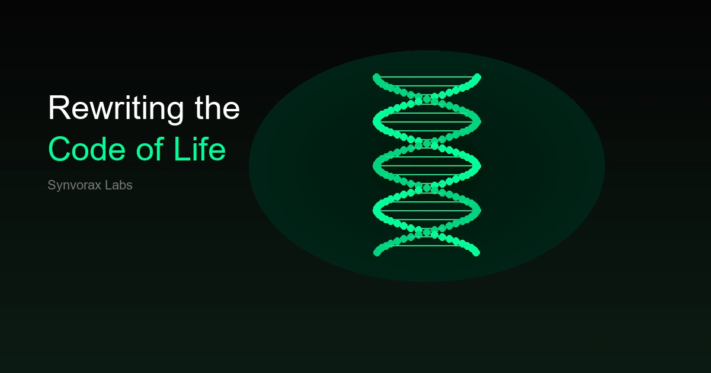

# Synvorax Labs

Ultra-premium static marketing website for a fictional biotechnology company. Fully JSON-driven, zero backend required.



## Features

- **JSON-driven content** — edit `data/catalog.json` to update the entire site
- **3D DNA helix** — Three.js animated hero visual with mouse parallax
- **Living background** — floating molecular particles with connections
- **Interactive catalog** — search, category/status filters, sorting, lazy load
- **Premium modal** — product details with gallery and specifications
- **GSAP animations** — scroll reveals, counters, parallax, hero entrance
- **Dark / light theme** — toggle with localStorage persistence
- **PWA-ready** — manifest, meta tags, OpenGraph, Twitter Cards
- **Fully responsive** — desktop, tablet, mobile

## Tech Stack

| Layer | Technology |
|-------|-----------|
| Markup | HTML5 |
| Styles | CSS3 (custom design system) |
| Logic | Vanilla JavaScript (ES6+) |
| 3D | Three.js r128 |
| Animation | GSAP 3 + ScrollTrigger |
| Scroll | Lenis |

No React, Vue, Angular, jQuery, or Bootstrap.

## Project Structure

```
synvorax-labs/
├── index.html              # Shell — no hardcoded content
├── data/
│   └── catalog.json        # All website content
├── css/
│   ├── style.css           # Design system & layout
│   ├── animations.css      # Animation states
│   └── responsive.css      # Breakpoints
├── js/
│   ├── app.js              # Main init & rendering
│   ├── catalog.js          # Product cards & lazy load
│   ├── search.js           # Search & filters
│   ├── animations.js       # GSAP scroll animations
│   ├── background.js       # Three.js particles + DNA helix
│   └── modal.js            # Product detail modal
├── assets/
│   ├── logo.svg
│   ├── hero.webp           # OG / social image
│   ├── hero.svg            # Vector fallback
│   ├── icons/              # Stat, research & social icons
│   └── images/             # Product illustrations
├── manifest.json           # PWA manifest
├── robots.txt
└── sitemap.xml
```

## Quick Start

### Local development

Requires any static file server (browsers block `fetch()` on `file://`).

**Python:**
```bash
cd synvorax-labs
python -m http.server 8080
```

**Node.js (npx):**
```bash
npx serve .
```

**VS Code / Cursor:** use the Live Server extension.

Open [http://localhost:8080](http://localhost:8080).

### Edit content

All text, products, navigation, stats, and footer links live in `data/catalog.json`. Change the JSON and refresh — no HTML edits needed.

Example — add a product:

```json
{
  "id": "svx-010",
  "name": "New Program",
  "description": "Short description for the card.",
  "longDescription": "Full description shown in the modal.",
  "category": "therapeutics",
  "status": "discovery",
  "dateAdded": "2026-01-01",
  "image": "assets/images/svx-010.svg",
  "gallery": ["assets/images/svx-010.svg"],
  "specifications": [
    { "label": "Modality", "value": "mRNA" }
  ]
}
```

## Deploy

The site is 100% static. Deploy the project root to any static host.

### Netlify

```bash
npm install -g netlify-cli
netlify deploy --prod --dir .
```

Or drag the folder into [app.netlify.com/drop](https://app.netlify.com/drop).

### Vercel

```bash
npm install -g vercel
vercel --prod
```

### GitHub Pages

1. Push the repo to GitHub
2. Settings → Pages → Source: `main` branch, root `/`
3. Site live at `https://<user>.github.io/<repo>/`

### Cloudflare Pages

Connect the repo or run:

```bash
npx wrangler pages deploy . --project-name synvorax-labs
```

### AWS S3 + CloudFront

```bash
aws s3 sync . s3://your-bucket-name --exclude ".git/*"
aws cloudfront create-invalidation --distribution-id YOUR_ID --paths "/*"
```

### Post-deploy checklist

- [ ] Update `seo.url` in `catalog.json` to your production domain
- [ ] Update `sitemap.xml` `<loc>` URL
- [ ] Update `robots.txt` Sitemap URL
- [ ] Verify OpenGraph image loads (`assets/hero.webp`)
- [ ] Run Lighthouse audit (target > 95)

## Performance Tips

- CDN libraries (Three.js, GSAP, Lenis) are loaded with `defer`
- Product images use `loading="lazy"`
- IntersectionObserver for lazy loading
- Three.js pixel ratio capped at 2×
- Particle count reduced on mobile (< 768px)

## Browser Support

Chrome 90+, Firefox 88+, Safari 14+, Edge 90+. WebGL required for 3D visuals.

## License

Fictional demo project — free to use and modify.
